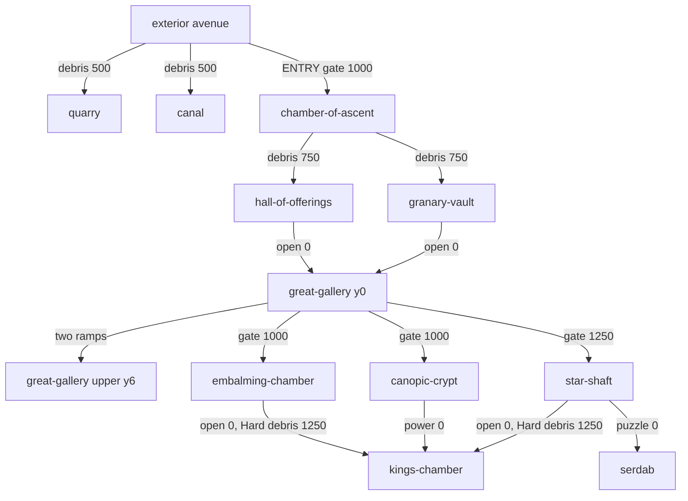

# MAP SURVEY - what is actually built, measured

Survey date 2026-08-01. This is a MEASUREMENT document, not a design document.
Nothing here proposes a room, a route, or a change. Every number was read out of
`src/`, out of a live page via `window.__SANDS__`, or out of `tools/trainability.mjs`.
Where a number could not be obtained it says so rather than estimating.

Sources read: `world/rooms.js`, `world/build.js`, `world/courtyard.js`,
`world/quarry.js`, `world/canal.js`, `world/temple.js`, `systems/spaces.js`,
`systems/doors.js`, `enemies/flow.js`, `enemies/director.js`,
`player/controller.js`, `ui/minimap.js`, `MAP.md`, `docs/WORLD-1.md`,
`docs/WORLDS.md`. Live figures were read out of `window.__SANDS__` in headless
Chromium after `start()`. Flood-fill figures carry their method inline.

---

## 1. BLUF

> **SUPERSEDED IN PART, 2026-08-01, later the same day.** Sections 1, 4 and 8's
> first two constraints described the map as it stood before World 1's descent
> was built. It is no longer flat: Act 3 sits at y = -6 and the interior's
> vertical range is now -6 to +6. `heightAt` seeds from a per-room `base` and
> `buildShell` seats floor, ceiling and doorway sill from it. The nav cap was NOT
> raised and `layersFull` still measures zero. **`docs/DESCENT.md` carries the
> current elevation table and the measurements behind it.** Everything else in
> this survey - the plan areas, the connectivity graph, the nav constants, the
> fourteen code-versus-docs discrepancies - was not touched and still holds.

- **The map is flat.** Nine interior rooms, and all nine floors are at **y = 0**.
  The only walkable surface anywhere above or below that plane inside the pyramid
  is the Great Gallery's second storey at **y = 6**. Total interior vertical
  range: **6.0 m, all of it upward.**
- **There is no descent structure at all.** No stairs, no shaft, no down-ramp, no
  sunken room. "Deeper" is currently the **-Z axis**: entry at z -140, King's
  Chamber back wall at z -272, so 132 m of horizontal run stands in for depth.
  `docs/WORLD-1.md:311` already states this correctly.
- **A floor below y = 0 is not representable today.** `build.js`'s `heightAt`
  opens with `let y = 0` and only ever takes the maximum of ramp surfaces above
  it; `buildShell` always seats the floor plane at y = 0 and the ceiling at
  `room.height`; a room record has no base-elevation field. The deepest walkable
  point in the whole game is **-3.34 m**, and it is the canal channel, outside.
- **There is plenty of plan area and it is not the constraint.** Interior net
  floor is **7,352 m²** inside a **13,728 m²** envelope (53.6 % used); a measured
  navigable flood with every barrier open reaches **6,750 m²**. A three-world
  descent does not need more square metres, it needs a **Y axis the engine does
  not have**.
- **The nav layer has a hard, named ceiling at two storeys.** `flow.js`
  `LAYERS = 2`, with an in-file note that "a third storey anywhere would need this
  raised" and a `layersFull` counter that silently drops routes when it is
  exceeded. `controller.js`'s `headroomAt` carries the identical caveat. A
  vertically layered map trips both.

---

## 2. INVENTORY

### 2a. Interior (`src/world/rooms.js`, geometry via `src/world/build.js`)

Bounds are `{x, z, w, d}` with x/z at the CENTRE. Walls are built **inward** at
`WALL_T = 1.0` on all four sides, so net floor is `(w-2) x (d-2)`. Floor y is 0
for every room, by construction. Ceiling is `room.height`; the ceiling plane is
placed at exactly that y.

| id | min x | max x | min z | max z | floor y | ceiling y | gross m² | net floor m² |
|---|---|---|---|---|---|---|---|---|
| chamber-of-ascent | -12 | 12 | -158 | -140 | 0 | 7 | 432 | 352 |
| hall-of-offerings | -50 | -12 | -158 | -140 | 0 | 9 | 684 | 576 |
| granary-vault | 12 | 38 | -158 | -140 | 0 | 7 | 468 | 384 |
| great-gallery | -26 | 26 | -196 | -158 | 0 | 16 | 1976 | 1800 |
| embalming-chamber | -44 | -14 | -232 | -196 | 0 | 8 | 1080 | 952 |
| canopic-crypt | -14 | 14 | -232 | -196 | 0 | 6 | 1008 | 884 |
| star-shaft | 14 | 40 | -232 | -196 | 0 | 30 | 936 | 816 |
| kings-chamber | -20 | 20 | -272 | -232 | 0 | 12 | 1600 | 1444 |
| serdab | 40 | 54 | -220 | -206 | 0 | 5 | 196 | 144 |
| **TOTAL** | | | | | | | **8380** | **7352** |

Doorway clear height is `min(DOOR_H 4.2, room.height - 0.8)`; anything above that
in a portal gap is emitted as a lintel. Measured wall records: **82**, spanning
y 0 to y 30.

### 2b. Interior second storey (Great Gallery only)

Read from the live `interior.ramps` array. Three flat ledges and two ramps, all
in `great-gallery`, all at `RAMP_T = 0.7` thick.

| kind | min x | max x | min z | max z | y0 | y1 | plan m² |
|---|---|---|---|---|---|---|---|
| west ledge | -25 | -17 | -195 | -172 | 6 | 6 | 184 |
| east ledge | 17 | 25 | -195 | -172 | 6 | 6 | 184 |
| bridge | -17 | 17 | -195 | -188 | 6 | 6 | 238 |
| west ramp | -25 | -17 | -172 | -160 | 6 | 0 | 96 |
| east ramp | 17 | 25 | -172 | -160 | 6 | 0 | 96 |
| **TOTAL** | | | | | | | **798** |

Headroom under the ledge is 6 m less the 0.7 slab; the gallery floor beneath it
stays walkable, which is what makes it a genuine second storey rather than a mezzanine.

### 2c. Exterior (`src/world/courtyard.js`, `quarry.js`, `canal.js`)

The exterior is a separate cell 110 units from the interior; the two are never
both live (`systems/spaces.js`). Ground is a displaced dune mesh, so its floor is
a continuous function rather than a set of rooms. Authored extents:

| space | min x | max x | min z | max z | envelope m² | floor elevations |
|---|---|---|---|---|---|---|
| PLAY (avenue + forecourt) | -23.2 | 23.2 | -33.0 | 38.4 | 3313 | dune, roughly 0 to +0.55 |
| QUARRY | 16.0 | 41.0 | -20.0 | 27.0 | 1175 | dune, plus terrace deck at 2.6 |
| CANAL | -46.0 | -15.0 | -21.0 | 21.0 | 1302 | dune, cut to -3.2 in the channel |
| EXTERIOR (`world.bounds`) | -46.0 | 41.0 | -33.0 | 38.4 | 6211.8 | see vertical profile |

Not floor: four quarry cut blocks at 1.7 / 2.9 / 4.3 / 5.8 high, sealed by
`fillMass` and unclimbable today; the 9 m bedrock face; the backdrop perimeter at
|x| = 52, which is explicitly never walked to.

Measured live collider counts: **interior 158 cylinders + 82 wall boxes**;
**exterior 629 cylinders, 0 wall boxes**. Exactly **one** interior collider
declares a raised base (`y0 > 0`): the Altar of Ptah on the gallery bridge.

Exterior pyramid mass (`temple.js`): `BASE_W = 62` wide, `STEPS = 11` at
`COURSE_H = 3.8`, so **41.8 m tall**, centred at z = -62, front face at z = -31.
The "62-unit stepped mass" quoted in `rooms.js` and both story docs is a **width**.

---

## 3. TOTAL FOOTPRINT

**Interior**

- Overall bounding box: x -50..54, z -272..-140, y 0..30.
  That is **104 x 132 x 30**. This is derived from the room records and matches
  `INTERIOR_BOUNDS` exactly.
- Bounding-box plan area: **13,728 m²**.
- Gross room footprint: 8,380 m² (61.0 % of the envelope).
- Net walkable floor after walls: **7,352 m²** (53.6 % of the envelope).
- Plus the gallery's second storey: 798 m². Total walkable surface **8,150 m²**.
- Measured navigable area, flood fill at `flow.js`'s own `STEP 0.7` / `PAD 0.55` /
  `CLIMB 0.65` / `DROP 1.5`, two layers, all nine barriers forced open:
  **13,776 slots = 6,750 m²**, of which **1,496 slots = 733 m² are the upper storey**.
  The 600 m² gap against net floor is the 0.55 body margin at every wall and prop.
- Envelope volume: 104 x 132 x 30 = 411,840 m³. Almost all of it is solid rock or
  ceiling void; the map uses one 6 m slice of it.

**Exterior**

- `world.bounds` envelope: 87 x 71.4 = **6,211.8 m²**.
- Measured ground elevation across that envelope, sampled at 0.5 m:
  **min -3.34 m at (-36.5, 4.5)**, **max +2.71 m at (17, -16)**.
- Reliable navigable area for the exterior was **not obtained**. My flood reached
  the avenue and the quarry but not the canal, and the game's own
  `director.reachesPlayer` disagrees with the player controller about the
  forecourt (see section 8). Both readings are reported there rather than being
  averaged into a figure that would be wrong.

---

## 4. VERTICAL PROFILE

**Every distinct walkable elevation in the game, measured.**

| y | what sits there | space |
|---|---|---|
| -3.34 to -3.2 | the canal channel floor and the wreck lying in it | exterior |
| -3.2 to 0 | the canal's two banks, a continuous batter | exterior |
| roughly -0.4 to +0.55 | the dune field: avenue, forecourt, quarry yard | exterior |
| 0.2 | the two canal causeway decks, spanning bank to bank | exterior |
| 2.21 | the talus deck at the canal breach mouth (x -19.6, z 13.5) | exterior |
| 2.6 | the quarry terrace bench, with a 7 m ramp at each end | exterior |
| 2.9 | the talus deck at the quarry breach mouth (x 19.6, z -13.5) | exterior |
| **0** | **the floor of all nine interior rooms** | interior |
| 6 | the Great Gallery's two ledges and the bridge joining them | interior |

**Vertical range actually used.**

- Interior: **0 to 6. Six metres, and every one of them is up.**
- Exterior: **-3.34 to +2.9. Six and a quarter metres**, of which 3.34 m is below
  its own grade.
- Whole game, both cells: **-3.34 to +6.0, a 9.34 m band.**

**Existing descent structure: none inside the pyramid.**

- No stairs anywhere in `src/`. No shaft. No down-ramp. The only ramps in the
  interior are the gallery's two, and they run 6 down to 0, which returns the
  player to the one floor plane that already existed.
- The Star Shaft is 30 m of ceiling. It is the tallest room in the map and it
  points **up**; its floor is y = 0 like every other room's.
- Inter-room elevation change: **zero.** All nine rooms share one floor plane, so
  every portal in the map is a level threshold.
- The exterior has the only real elevation play in the project: the canal cuts
  3.2 m down, the quarry terrace climbs 2.6 m up, both reachable by ramp.

**How far down does the map currently go? 3.34 metres, outside the pyramid.**
Inside it, zero. The pyramid does not descend at all.

**What the story asks for, against what the code can express.**

`build.js`'s interior floor sampler is the binding constraint, and it is four lines:

```js
heightAt(x, z, footY) {
  let y = 0;
  ...
  for (const r of ramps) { ... if (h > y && h <= reach) y = h; }
  return y;
}
```

`y` starts at 0 and only rises. A room authored at y = -20 would be reported as
standing on y = 0 by the player controller, the mummies, the grenades and the flow
field alike. `buildShell` likewise hard-codes `floor.position.set(x, 0, z)` and
`ceil.position.set(x, h, z)`. The room record in `rooms.js` has `bounds {x,z,w,d}`
and `height`, and no y at all. Three worlds descending is a change to that
signature before it is a change to any room.

---

## 5. CONNECTIVITY GRAPH

Portals are authored once, on the room nearer the entrance, and are undirected.
Eleven authored portals plus `ENTRY`. `kind` and `cost` are as `allPortals()`
reports them; `onHard` is the Hard-tier override applied by `difficulty.lock()`.

**Adjacency list**

```
exterior avenue  -- ENTRY, gate 1000, width 4.5, threshold teleport --> chamber-of-ascent
exterior avenue  -- claim "The Quarry", debris 500 --> quarry
exterior avenue  -- claim "The Canal",  debris 500 --> canal

chamber-of-ascent -- debris 750, w 4.0, at (-12,-149) --> hall-of-offerings
chamber-of-ascent -- debris 750, w 4.0, at ( 12,-149) --> granary-vault
hall-of-offerings -- open   0,   w 4.5, at (-19,-158) --> great-gallery
granary-vault     -- open   0,   w 4.5, at ( 19,-158) --> great-gallery
great-gallery     -- gate  1000, w 4.0, at (-20,-196) --> embalming-chamber
great-gallery     -- gate  1000, w 4.0, at (  0,-196) --> canopic-crypt
great-gallery     -- gate  1250, w 4.0, at ( 20,-196) --> star-shaft
embalming-chamber -- open   0,   w 4.0, at (-17,-232) --> kings-chamber   [Hard: debris 1250]
canopic-crypt     -- power  0,   w 5.0, at (  0,-232) --> kings-chamber
star-shaft        -- puzzle 0,   w 2.4, at ( 40,-213) --> serdab
star-shaft        -- open   0,   w 4.0, at ( 17,-232) --> kings-chamber   [Hard: debris 1250]

great-gallery floor <-> great-gallery upper ring, via the two ramps at x +/-21, z -172..-160
```

Degree: gallery 5, star-shaft 3, kings 3, serdab 1, everything else 2.
`tools/trainability.mjs` reports four cycles and exits 0.



---

## 6. NAV CONSTRAINTS

All from `src/enemies/flow.js` unless noted.

| constant | value | what it binds |
|---|---|---|
| `STEP` | 0.7 m | cell size. Chosen so a 4.0 m portal less `PAD` is 4 cells across. |
| `PAD` | 0.55 m | carving disc. Matches the director's `NAV_PAD`. |
| `BODY_H` | 2.0 m | head height for the wall test |
| `CLIMB` | 0.65 m | max rise per orthogonal step (x1.4142 on a diagonal) |
| `DROP` | 1.5 m | max fall per step |
| `LAYERS` | **2** | **storeys per (x,z). Hard cap.** |
| `SURFACE_TOL` | 0.45 m | when two heights at one cell are the same surface |
| `LEVEL_TOL` | 1.0 m | how far off a layer a reader may be |
| `READ_DOWN` | 2.2 m | how far below its feet an actor may read a layer |
| `MAX_REACH` | 160 m | geodesic flood cut-off |
| `MAX_COST` | 1143 | `ceil((160 / 0.7) * 5)` |

**The field is NOT a fixed-size array.** `resize()` reallocates on every space
transition: `Int32Array(n*2)`, `Float32Array(n*2)`, `Uint8Array(n*2)` where
`n = floor(W/0.7)+1` by `floor(D/0.7)+1`. Measured live:

| space | grid | cells | slots | typed-array bytes |
|---|---|---|---|---|
| interior (`INTERIOR_BOUNDS`, maxZ + 0.5) | 149 x 190 | **28,310** | 56,620 | ~509 KB |
| exterior (`world.bounds`) | 125 x 103 | **12,875** | 25,750 | ~232 KB |

**The four ceilings a map lane has to respect.**

1. **Two storeys per (x,z), and that is a hard wall.** A third floor stacked over
   the same plan position drops relaxations, counted in `stats().layersFull`,
   which is measured **zero** today. `flow.js:243` says so explicitly: "A third
   storey anywhere would need this raised." `player/controller.js` `headroomAt`
   carries the identical caveat in its own words. A three-world vertical descent
   that reuses plan coordinates hits this before it hits anything else.
2. **Memory and flood cost are linear in cells and quadratic in resolution.**
   Doubling the interior envelope doubles the cell count and the per-cell
   clearance work. Halving `STEP` to 0.35 quadruples it; `flow.js` states the
   trade as 28,161 cells against 112,266 for the same rectangle. I did not measure
   the frame-time consequence of either.
3. **`MAX_REACH = 160 m` geodesic is already close.** The current interior
   envelope's own diagonal is `hypot(104, 132) = 168 m` in a straight line, and
   `flow.js` records that a geodesic route on a looped map runs about three times
   the straight-line distance (the gallery ring is 88 m of walking to cover 28 m
   of ground). The guard does not bind on the routes that exist today; it will
   bind on a map materially larger than this one.
4. **The exterior's second nav system is finer and costs more.**
   `director.js` `NAV_STEP = 0.35`, `NAV_PAD = 0.55`, `NAV_PAD_BOSS = 1.85`, built
   twice per space transition, exterior only. The interior deliberately has no
   walk-component field: `director.js:1017` says the room graph answers
   reachability exactly and a geometric fill "cut its 21 authored points to 3".

Documented and unfixed: `flow.js:196` records a layer-selection oscillation where a
ramp passes exactly `READ_DOWN` above the floor beneath it, measured at
(-23.75, -164.40) with feet flicking between 2.19 and 2.21. Six of seven remaining
stuck actors are that one strip of the gallery's west ramp. Every additional
vertical layer creates another such strip.

---

## 7. CODE-VS-DOCS DISCREPANCIES

**Fourteen found.** Ordered by how much they would mislead a map lane.

| # | doc claim | what the code does | live |
|---|---|---|---|
| 1 | `MAP.md:185` "One span across the south end at **z -195..-192**, at height 6" | the bridge is `{x:0, z:-191.5, w:34, d:7}`, so **z -195..-188**, seven deep not three. `rooms.js:265` documents the change and its reason (the Altar collider is 2.1 across and would have corked a 3 m catwalk) | **code** |
| 2 | `MAP.md:16` status row "Act 1 circuit, Quarry and Canal - BUILT, **purchase wiring pending**" | `doors.js:283` adopts `courtyard.claims` into `courtyardTargets` and into `doors.all`. Measured: `doors.all` contains `courtyard/quarry` and `courtyard/canal`, debris, 500 gold each, raycastable | **code, it is wired** |
| 3 | `courtyard.js` claims doc-block: "Until that file iterates this array... both spaces are built, sealed, and **unreachable in play**" | false against `doors.js` as shipped. This is a stale comment inside the source, not just inside a plan | **doors.js** |
| 4 | `MAP.md:50` "It is deliberately NOT in `npm test` today, **because it fails**" | `node tools/trainability.mjs` prints "THE LAW: every room with spawn points is in a cycle", all ok, and **exits 0**. It still is not in `npm test` | **code passes; the exclusion reason is stale** |
| 5 | `MAP.md:23` status row "B3AR - in progress" | built and placed: `courtyard.js:2660` `buildWallBuyFixture({config:{weapon:'b3ar', cost:400}})`, and `b3ar` is in `weapons.js` `SLOTS` and `CHALK` | **code, it is built** |
| 6 | `docs/WORLD-1.md:356` and `:1338` "the Star Shaft... **with a rope in it** that goes up into the dark", written as a thing already doing its job | `grep -rn "rope" src/` returns nothing. `rope` appears only in the same document's own PROPOSAL list of six new `propSlot` types | **code, there is no rope** |
| 7 | `docs/WORLDS.md:264` "The way out is **the eleventh niche in the Serdab**" | the Serdab has `interactSlots: []` and no niche propSlot. The only four niches in the game are in the Embalming Chamber. Marked PROPOSAL in `WORLD-1.md:1075` | **code, unbuilt** |
| 8 | `MAP.md:174` Act 1 requires "a **circumnavigable mass at the forecourt centre**" | `courtyard.js:1197` states the opposite intent: "the forecourt between the stubs and the temple front **stays open**". No such mass exists, and no status row tracks it | **code; the requirement is unbuilt and untracked** |
| 9 | `docs/WORLD-1.md:285` proposes a `Depth N m` HUD row derived from "a `depth` field per room in `rooms.js`" | no `depth` field exists in `rooms.js`; no depth row in the HUD. Correctly marked PROPOSAL, listed here so nobody reads the metre figures as shipped | **code, unbuilt** |
| 10 | `flow.js:64` "the interior's 104 x 132 rectangle is **28,161 cells** at 0.7" | the live grid is **149 x 190 = 28,310**, because `spaces.js:525` hands the field `INTERIOR_BOUNDS.maxZ + 0.5`. The exterior figure in the same comment, 12,875, is exact | **code; the comment is 149 cells light** |
| 11 | `MAP.md:25` status row "SMG moving out to Act 1 - NOT BUILT" sits directly above an owner decision that the SMG **stays inside at 1000** | code has the SMG on the Chamber of Ascent wall at 1000. The status row describes a move that was cancelled, so it reads as outstanding work | **code and the owner decision agree; the status row is misleading** |
| 12 | `MAP.md:167` the Quarry gives "cut blocks at **three or four heights**"; `quarry.js:7` claims "**six floor heights** inside forty metres" | four free blocks at 1.7 / 2.9 / 4.3 / 5.8, plus grade and a 2.6 terrace. The blocks are sealed by `fillMass` and `quarry.js:299` confirms "**Nothing can today** - none of the ramps reach a block". Walkable heights are grade and 2.6 only | **code; both counts include unreachable masses** |
| 13 | `rooms.js:12` and both story docs, "the playable interior is far larger than the **62-unit stepped mass**" | true, and the 62 is `BASE_W`, a **width**. The mass is `STEPS 11 x COURSE_H 3.8 = 41.8 m tall`. Anyone reading 62 as a vertical budget for a descent is reading a floor plan number | **code; the docs are correct but the unit is ambiguous** |
| 14 | `MAP.md:162` "a circuit with the avenue: Avenue -> Quarry -> Canal -> Avenue, **roughly 150 m**" | **not determinable from code.** I did not measure the circuit length; the two spaces are on opposite sides of the avenue and the route depends on which of the four mouths is used | **unverified** |

**Checked and found accurate**, so the map lane can trust them: the ceiling ladder
in `WORLDS.md:186` / `WORLD-1.md:330` (all nine heights exact); `MAP.md:124` ledge
coordinates; `MAP.md:213` the dropped serdab spawns; `MAP.md:200` and `:220` the
two six-unit shared wall lines at z -232; `MAP.md:391` jar 1 outside
(`courtyard.js:2285`, at (-19.0, 22.5)); `MAP.md:373` Pack-a-Punch on the bridge
(altar at (0, -193, y 6), 5000 / 2000 repeat); the whole `MAP.md:92` trainability
table; and `WORLD-1.md:311` "every floor is at y=0 and deeper runs along -Z from
-140 to -272", which is the most important sentence in the docs and is correct.

---

## 8. HONEST CONSTRAINTS

Specific mechanisms, named files, measured counts. Where I did not measure, it says so.

**1. The interior floor sampler cannot express a floor below zero.**
`build.js` `heightAt` starts at `let y = 0` and monotonically rises through the
ramp list. `buildShell` seats every floor plane at 0. `rooms.js` room records have
no y field. This is the whole of the descent problem in three places, and every
downstream system (player controller, mummies, grenades, the flow field, spawn
placement) reads the same function, so the change is one function and one record
shape, not nine call sites. The exterior sampler already handles negative ground
(`courtyard.js` `groundY` returns -3.34 in the canal), so a working pattern exists.

**2. Two storeys is a hard cap in two independent systems.**
`flow.js` `LAYERS = 2` (slot layout keyed `k * LAYERS + s`), and
`controller.js` `headroomAt`, whose own comment reads: "That last branch finds the
HIGHEST surface, not the LOWEST one overhead. In a building with three storeys, a
player under the middle floor would be told about the top one... This map has two,
so it is exact here." Both would need work before a third stacked level exists.
`flow.js` at least fails loudly: `stats().layersFull` counts what it dropped.

**3. The player's own collision is a linear scan, and the counts are small today.**
`controller.js` iterates `world.colliders` and `world.walls` as flat arrays with
no spatial index: `resolveCollisions` runs two passes, each calling `resolveWalls`
(full wall list) then the full collider list, plus one more full pass in
`headroomAt`. Measured: **interior 158 colliders + 82 walls; exterior 629 colliders
+ 0 walls**. The horde does NOT share this path - it goes through
`director.js` `createColliderGrid`, a bucketed spatial hash with an oversized-item
list (measured: 619 gridded, 10 oversized, cell size 5). So collider growth costs
the player's loop linearly and the horde's loop roughly nothing.
**I did not measure frame time.** No performance claim is made here.

**4. The space router is a two-way toggle, by string.**
`systems/spaces.js` builds exactly one interior at boot, holds `active` as
`'exterior' | 'interior'`, and rewrites five fields of one shared `world` object.
`grep` finds **34** comparisons against those two literals across 10 files
(`main.js`, `ui/death.js`, `ui/interact.js`, `ui/minimap.js`, `ui/objective.js`,
`world/build.js`, `core/audio.js`, `systems/spaces.js`, `systems/doors.js`,
`enemies/director.js`). A third and fourth world is either more room records inside
the one interior cell, or a real change to that router.

**5. Several systems infer "inside" from the Z coordinate, not from the space.**
`ui/minimap.js` filters actors with `p.z > INTERIOR_BOUNDS.maxZ`,
`boss.position.z <= INTERIOR_BOUNDS.maxZ` and `actor.position.z < INTERIOR_BOUNDS.maxZ`
(that is, z = -140 as the world boundary), and its own comment at line 565 flags
the assumption: "from z -140, but nothing guarantees that forever".
`core/fog.js:869` and `world/sky.js:642` also key off `INTERIOR_BOUNDS`. Worlds
stacked on Y at overlapping Z would break all of these; worlds laid out further
along -Z would not.

**6. The two thresholds are hard-coded z lines with hard-coded fade windows.**
`doors.js` `ENTER_AT = {z:-31.6, halfWidth:2.6, fadeFrom:-27.6, blackBy:-30.0}` and
`EXIT_AT = {z:-140.8, halfWidth:2.2, fadeFrom:-144.6, blackBy:-141.6}`, plus two
hand-placed sheets at z 0.15 and z -141.06 whose positions are argued from the
geometry immediately behind them. Every new world boundary needs the same pair of
sheets and the same argument; none of it is parameterised.

**7. Elevated props are decoration only, deliberately.**
`build.js` `buildProps` discards the colliders of any slot with a `y`
(`if (slot.y) colliders.length = before;`). Only interacts keep theirs. The
controller has since grown the missing below-the-base test that this worked around,
and the comment says the workaround "can now go whenever someone wants decoration
on an upper level to be solid". A vertically layered map will want that.

**8. The exterior's nav field is fragmented, and I could not reconcile it.**
Measured at wave 0, player at the spawn (0, 30), sealed doorway shut:
`director.stats()` reports **`walkComponents: 23`** and **62 of 176 spawn points
reachable**. Probing `director.reachesPlayer` along the avenue centreline, the
player's island runs z +32 down to -26 and, at z = 10, only x -4 to +14. It
reports the forecourt at (0, -28), the whole canal, and the quarry yard as **not**
in the player's island - yet the interior test suite walks the player to the
threshold at z -31.6 every run, and the quarry terrace probes true. Either the
0.55-padded 4-connected field is stricter than the controller's own collision, or
something is genuinely sealed. **I did not determine which**, and it is an exterior
finding, not an interior one: `director.js:1017` disables the walk-component field
inside the pyramid entirely. Flagged because a map lane widening the exterior will
meet it.

**9. What is NOT a constraint.** Plan area. The interior uses 53.6 % of its own
bounding box and the envelope is defined by one exported constant
(`INTERIOR_BOUNDS`) that five files read. Adding rooms along -Z is cheap in every
system measured here. The expensive axis is Y.
