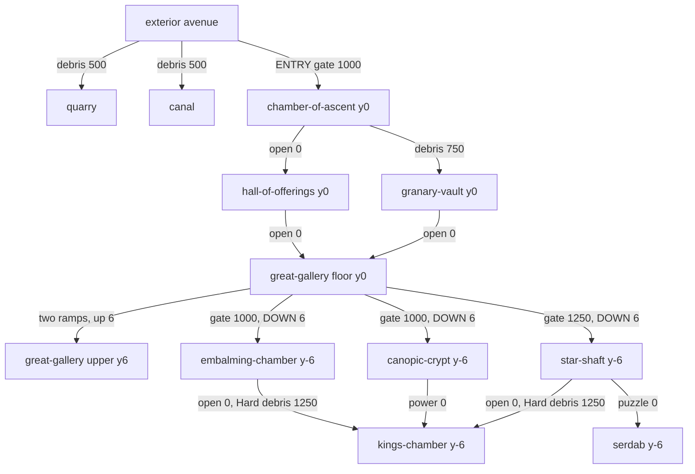

# MAP SURVEY - what is actually built, measured

Survey date 2026-08-02, rewritten from the ground up against a map that changed
under the previous survey. This is a MEASUREMENT document, not a design document.
Nothing here proposes a room, a route, or a change. **No figure below was carried
forward from the previous version of this file.** Every number was recomputed
today from `src/world/rooms.js`, read out of a live page through
`window.__SANDS__` in headless Chromium after `start()`, or printed by a harness
run today. Where a number could not be obtained it says **not determined** rather
than being estimated or inherited.

Sources read today: `world/rooms.js` (in full), `world/build.js`,
`world/weathering.js`, `world/materials.js`, `world/temple.js`,
`enemies/flow.js`, `enemies/director.js`, `MAP.md`, `docs/DESCENT.md`,
`docs/FLAT-MAP-AUDIT.md`, `docs/WORLDS.md`. Harnesses run today:
`tools/trainability.mjs` and `test/descent.mjs`, both to completion.

**What this file does not own.** `docs/DESCENT.md` owns the descent's design
record, its own elevation table and the measurements behind the drop, including
the lighting defect in its section 6 and the fix in 6a. `docs/FLAT-MAP-AUDIT.md`
owns the register of code written when the map was flat. `docs/WORLDS.md` owns
World 2's specification. This file measures what is standing and reports where
the code and the documents disagree.

---

## 1. BLUF

- **The map is not flat, and it never was two floors by accident.** Nine interior
  rooms across **two elevations**. Four rooms sit at **y = 0**: the Chamber of
  Ascent, the Hall of Offerings, the Granary Vault and the Great Gallery. Five
  sit at **y = -6**: the Embalming Chamber, the Canopic Crypt, the Star Shaft,
  the King's Chamber and the Serdab. Every room record carries an explicit
  `base`, and `buildShell` seats floor, ceiling and walls from it.
- **The interior's vertical range is -6 to +6. Twelve metres, half of it down.**
  The floor drops six at the Act 2 to Act 3 seam and the Great Gallery's upper
  ring still climbs six above the datum. Ceilings run from **-1** (the Serdab,
  the lowest surface in the world) to **+24** (the Star Shaft).
- **One descent, built three times.** Three ramps, one behind each of the
  gallery's three gates, each 8 m wide, 16 m of run for 6 m of fall, gradient
  **0.375**. There is no other elevation change between rooms anywhere in the
  interior.
- **Net interior floor is 7,544 m²** inside a **14,520 m²** bounding box, 52.0 %
  used. Gross room footprint is **8,596 m²**, 59.2 %. Plan area is still not the
  constraint; the constraint is the doorway rule in section 7.
- **Twelve openings, and every one of them measures 4.2 m clear.** One of the
  twelve, `star-shaft -> serdab`, achieves that with **exactly zero slack**, and
  the builder has no lower bound on the arithmetic that produced it.
- **The nav layer's two-storey cap is not being hit.** `flow.js` `LAYERS = 2`,
  and `layersFull` measured **0** today with the descent in and all three ramps
  standing over their own floors.

---

## 2. INVENTORY

### 2a. Interior rooms (`src/world/rooms.js`, geometry via `src/world/build.js`)

Bounds are `{x, z, w, d}` with x/z at the CENTRE. Each room builds its own four
walls **inward** at `WALL_T = 1.0` (`buildShell` places each slab at
`x0 + WALL_T/2` and friends), so net floor is `(w-2) x (d-2)` and a shared wall
line between two rooms carries 2.0 m of stone, one metre owned by each.

**Floor y is the room's `base`. Ceiling y is `base + height`.** `height` is
measured from the room's own floor and is not a world coordinate, which is why
two of the columns below move in opposite directions.

| id | min x | max x | min z | max z | floor y | height | ceiling y | gross m² | net m² |
|---|---|---|---|---|---|---|---|---|---|
| chamber-of-ascent | -18 | 18 | -158 | -140 | 0 | 7 | 7 | 648 | 544 |
| hall-of-offerings | -56 | -18 | -158 | -140 | 0 | 9 | 9 | 684 | 576 |
| granary-vault | 18 | 44 | -158 | -140 | 0 | 7 | 7 | 468 | 384 |
| great-gallery | -26 | 26 | -196 | -158 | 0 | 16 | 16 | 1976 | 1800 |
| embalming-chamber | -44 | -14 | -232 | -196 | **-6** | 12 | 6 | 1080 | 952 |
| canopic-crypt | -14 | 14 | -232 | -196 | **-6** | 12 | 6 | 1008 | 884 |
| star-shaft | 14 | 40 | -232 | -196 | **-6** | 30 | 24 | 936 | 816 |
| kings-chamber | -20 | 20 | -272 | -232 | **-6** | 12 | 6 | 1600 | 1444 |
| serdab | 40 | 54 | -220 | -206 | **-6** | 5 | **-1** | 196 | 144 |
| **TOTAL** | | | | | | | | **8596** | **7544** |

By datum:

| datum | rooms | gross m² | net m² |
|---|---|---|---|
| y = 0 | 4: ascent, hall, granary, gallery | 3776 | 3304 |
| y = -6 | 5: embalming, crypt, shaft, kings, serdab | 4820 | 4240 |

Verified live through the game's own `world.heightAt` (`test/descent.mjs`, run
today): all nine rooms sample at their authored floor, and every ceiling clears
its own floor by its authored height. The Embalming Chamber and the Canopic
Crypt each read `height 12` and `ceiling 6`: their authored heights doubled and
their absolute ceilings did not rise, because the floor went down instead.

Contents, counted from the records: **31 spawn points, 109 prop slots, 19
interact slots**. Interacts break down as 4 wall buys, 6 shrines, 3 mystery box
spawns, 4 niches, 1 power fixture, 1 altar. Live `interior.interacts` is 19,
which agrees.

### 2b. Every surface that is not a room floor

Ledges and ramps share one record shape and one array; a ledge is a record where
`y0 === y1`. Read from the live `interior.ramps` array today. All are
`RAMP_T = 0.7` thick. y values below are ABSOLUTE, after the room's base has been
added.

| record | room | min x | max x | min z | max z | y0 | y1 | plan m² | gradient |
|---|---|---|---|---|---|---|---|---|---|
| west ledge | great-gallery | -25 | -17 | -195 | -172 | 6 | 6 | 184 | flat |
| east ledge | great-gallery | 17 | 25 | -195 | -172 | 6 | 6 | 184 | flat |
| bridge | great-gallery | -17 | 17 | -195 | -188 | 6 | 6 | 238 | flat |
| west ramp | great-gallery | -25 | -17 | -172 | -160 | 6 | 0 | 96 | 0.500 |
| east ramp | great-gallery | 17 | 25 | -172 | -160 | 6 | 0 | 96 | 0.500 |
| west descent | embalming-chamber | -24 | -16 | -212 | -196 | -6 | 0 | 128 | 0.375 |
| centre descent | canopic-crypt | -4 | 4 | -212 | -196 | -6 | 0 | 128 | 0.375 |
| east descent | star-shaft | 16 | 24 | -212 | -196 | -6 | 0 | 128 | 0.375 |
| **TOTAL** | | | | | | | | **1182** | |

That is **606 m² of flat deck at +6**, **192 m² of gallery slope** spanning 0 to
6, and **384 m² of descent slope** spanning -6 to 0. Eight records across four
rooms; the previous survey's inventory of five records in one room is superseded.

Three consequences worth recording because they are each a real object:

- **Stone under every descent doorway.** Measured live from `world.walls`: one
  box per descent gate, `y0 -6, y1 -0.7`, 4.0 wide. It stops one ramp thickness
  short of the sill deliberately, because the ramp itself closes the gap from
  above and stone taken all the way to the sill would stand proud of the walkway.
- **Stepped stone filling the undercroft of every rising ramp.** `fillUndercroft`
  runs on every ramp record with a non-zero rise and lays 1.0 m boxes until the
  headroom under the slab reaches `UNDERCROFT_MIN = 2.0`. Computed from the
  constants and the ramp records: **4 boxes under each gallery ramp** (gradient
  0.5, break at 6 m of run) and **6 under each descent ramp** (gradient 0.375,
  break at 8 m), **26 boxes in total**, all pushed into `walls`. This applies to
  the Great Gallery's two ramps, which is a change to a previously shipped room.
  `docs/DESCENT.md` section 6b owns the defect it closes.
- **A kerb on every flat ledge**, 0.55 tall and 0.5 thick, on the ledge's inner
  edge. The bridge takes it as a 34 m parapet at z = -188.

### 2c. Live collider and wall counts

Read from `window.__SANDS__.interior` after `start()`, today, on a fresh boot
with no difficulty override applied.

| measure | value |
|---|---|
| wall records | **111**, spanning y **-6 to 24** |
| collider cylinders | **153** |
| ramp and ledge records | 8 |
| barrier records | 8 |
| interact records | 19 |
| `doors.all` | 11 entries |

Collider bases, by `y0`: **87 at 0**, **65 at -6**, **1 at 6**. The one at 6 is
the Altar of Ptah on the gallery bridge, and it remains the only collider in the
interior that stands above its own room's floor. The 65 at -6 are not raised;
they are Act 3's props standing on Act 3's floor, and their existence is the
clearest single signal that the map now has two datums.

`doors.all` carries three exterior entries (`courtyard/entry` gate 1000,
`courtyard/quarry` debris 500, `courtyard/canal` debris 500) and the eight
interior barriers. `chamber-of-ascent/hall-of-offerings` appears in neither list,
which is the measurable difference between an `open` portal and a zero-cost door.

### 2d. Exterior

**The exterior was not re-surveyed in this pass and no exterior figure is carried
forward.** Nothing about the descent or the entry-room widening touched
`courtyard.js`, `quarry.js` or `canal.js`, but "probably unchanged" is not a
measurement. What was re-read today and can be stated: the play area is authored
at `PLAY = { minX: -23.2, maxX: 23.2, minZ: -33.0, maxZ: 38.4 }`
(`courtyard.js:100`), and the exterior pyramid mass in `temple.js` is
`BASE_W = 62` wide with `STEPS = 11` at `COURSE_H = 3.8`, so **41.8 m tall**. The
62 is a WIDTH and is repeatedly misread as a vertical budget.

Exterior ground elevations, navigable area, and collider counts: **not
determined in this pass.**

---

## 3. TOTAL FOOTPRINT

**Interior**

- Overall bounding box derived from the nine room records: **x -56..54,
  z -272..-140, y -6..24**. That is **110 x 132 x 30**.
- `INTERIOR_BOUNDS` is `{ minX: -56, maxX: 54, minZ: -272, maxZ: -140 }` and
  matches the derived box exactly in plan. **It has no Y component at all**, so
  nothing in it records that the world now goes below zero.
- Bounding-box plan area: **14,520 m²**.
- Gross room footprint: **8,596 m²** (59.2 % of the envelope).
- Net walkable floor after walls: **7,544 m²** (52.0 %).
- Plus 1,182 m² of ramp and deck stacked over floor already counted, for
  **8,726 m² of walkable surface** across two storeys.
- Envelope volume: 110 x 132 x 30 = **435,600 m³**. The map now uses a 12 m slice
  of it rather than a 6 m one.
- Measured navigable flood area with every barrier open: **not determined.** The
  previous figure was taken before both the descent and the entry-room widening
  and is not carried forward. Re-taking it needs a flood at `flow.js`'s own
  constants across two layers, which was not run in this pass.

**The plan grew, and by exactly one room's worth.** The Chamber of Ascent went
from 24 x 18 to 36 x 18, which is +216 gross and +192 net; the Hall of Offerings
and the Granary Vault moved six west and six east respectively at unchanged size;
`INTERIOR_BOUNDS.minX` went from -50 to -56 to follow the Hall. Those three moves
are the whole of the difference between this survey's totals and the last one's.

---

## 4. VERTICAL PROFILE

This is the section the previous survey got wrong end to end, so it is stated
from the records rather than from memory of them.

**Every distinct walkable elevation inside the pyramid.**

| y | what sits there | extent |
|---|---|---|
| **-6** | the floors of the Embalming Chamber, the Canopic Crypt, the Star Shaft, the King's Chamber and the Serdab | 4,240 m² net |
| -6 to 0 | three descent ramps, 8 m wide, 16 m of run for 6 m of fall | 384 m² of plan |
| **0** | the floors of the Chamber of Ascent, the Hall of Offerings, the Granary Vault and the Great Gallery | 3,304 m² net |
| 0 to 6 | the Great Gallery's two ramps, 8 m wide, 12 m of run for 6 m of rise | 192 m² of plan |
| **6** | the Great Gallery's two ledges and the bridge joining them | 606 m² of plan |

**Vertical range actually used.**

- Interior walkable surfaces: **-6 to +6. Twelve metres, six down and six up
  from the datum.**
- Interior ceilings: **-1 to +24**, a 25 m band. The lowest is the Serdab's, and
  it is the lowest surface of any kind in World 1.
- Whole envelope, floors to ceilings: **-6 to +24, thirty metres.**
- Exterior: **not determined in this pass.** No whole-game range is stated here,
  because half of it was not measured.

**The datum, and what is pinned to it.**

`chamber-of-ascent` is `base: 0` and cannot move. The sealed doorway hands the
player over at a real opening whose two fade sheets and threshold z are
hand-placed absolute geometry argued from the courtyard grade
(`systems/doors.js`). Every other elevation in the map is measured against that
one room.

**The descent, walked.** `test/descent.mjs` was run today and drives the centre
descent on real frames through the real main loop. Measured profile, z against
feet: the player leaves the gallery at feet 0 and z -193.5, crosses the threshold
at z -196 still at 0, and arrives at feet -6 at z -212.58, forty-five frames
later, grounded and inside the Canopic Crypt. The intermediate readings fall
monotonically (-0.60, -1.17, -2.01, -2.42, -3.37, -3.73, -4.50, -5.10, -5.69),
which is what makes it a slope rather than a cliff. All six legs, three down and
three up, complete.

**One descent, and the second one was declined rather than missed.**
`star-shaft -> serdab` is the only bridge in the room graph, so it is the only
place a further drop would cost one ramp instead of two or three. It was costed
and declined; `docs/DESCENT.md` section 8 owns that record.

---

## 5. CONNECTIVITY GRAPH

Portals are authored once, on the room nearer the entrance, and are undirected.
**Eleven authored portals plus `ENTRY`, so twelve openings.** That count was
re-derived today from `allPortals()` and it is unchanged; what changed underneath
it is one portal's kind, two portals' positions, and three portals' meaning.

**Adjacency list.** `kind` and `cost` are as `allPortals()` reports them;
`onHard` is the Hard-tier override. `step` is the elevation change across the
threshold.

```
exterior avenue  -- ENTRY, gate 1000, w 4.5, at (0,-140)      --> chamber-of-ascent   step 0

chamber-of-ascent -- open   0,   w 4.0, at (-18,-149) --> hall-of-offerings   step 0
chamber-of-ascent -- debris 750, w 4.0, at ( 18,-149) --> granary-vault       step 0
hall-of-offerings -- open   0,   w 4.5, at (-22,-158) --> great-gallery       step 0
granary-vault     -- open   0,   w 4.5, at ( 22,-158) --> great-gallery       step 0
great-gallery     -- gate  1000, w 4.0, at (-20,-196) --> embalming-chamber   step -6
great-gallery     -- gate  1000, w 4.0, at (  0,-196) --> canopic-crypt       step -6
great-gallery     -- gate  1250, w 4.0, at ( 20,-196) --> star-shaft          step -6
embalming-chamber -- open   0,   w 4.0, at (-17,-232) --> kings-chamber       step 0   [Hard: debris 1250]
canopic-crypt     -- power  0,   w 5.0, at (  0,-232) --> kings-chamber       step 0
star-shaft        -- puzzle 0,   w 2.4, at ( 40,-213) --> serdab              step 0
star-shaft        -- open   0,   w 4.0, at ( 17,-232) --> kings-chamber       step 0   [Hard: debris 1250]

great-gallery floor <-> great-gallery upper ring, via the two ramps at x +/-21, z -172..-160
```

**Three portals cross the drop, and they are the only three.** All three are the
gallery's gates, and each is answered by a ramp on the low side. Every other
threshold in the map is level.

**Degree:** gallery 5, star-shaft 3, kings 3, serdab 1, everything else 2. Nine
rooms, eleven portals, one component, so **three independent cycles**; the tool
enumerates four named loops, of which three are in Act 3.

**Cost to close each loop**, from `tools/trainability.mjs`, run today:

| loop | doors | cost |
|---|---|---|
| ascent - hall - gallery - granary - ascent | open, open, open, debris 750 | **750** |
| crypt - gallery - embalming - kings - crypt | gate 1000, gate 1000, open, power | 2000 |
| embalming - gallery - shaft - kings - embalming | gate 1000, gate 1250, open, open | 2250 |
| crypt - gallery - shaft - kings - crypt | gate 1000, gate 1250, open, power | 2250 |

The Act 2 train costs **750** to close, not 1500. The Chamber of Ascent's west
door is `kind: 'open'` at cost 0 and therefore has no barrier object at all; the
Granary Vault keeps its 750, and it is now the purchase that closes the loop
rather than a toll on leaving the first room.

Sum of all authored portal costs: **4,000**, plus `ENTRY` at 1,000. On Hard the
two King's Chamber portals wall at 1,250 each, so **6,500** plus `ENTRY`.

**Door count, recounted.** Twelve openings is one number and the number of doors
is another:

- **12 openings** in the room graph, 11 authored plus `ENTRY`.
- **8 interior barrier records**, plus `ENTRY`'s granite slab in the courtyard
  group. Barriers are built for every portal whose `kind` is not `open`, and they
  are built as though the tier were Hard **always**, with the two Hard-only ones
  dissolved by `start()` on Easy and Normal.
- **6 interior barriers stand on Easy and Normal**, 8 on Hard. Before the entry
  room's west door became `open`, it was 7 and 9.



---

## 6. NAV CONSTRAINTS

All from `src/enemies/flow.js` unless noted, re-read today.

| constant | value | what it binds |
|---|---|---|
| `STEP` | 0.7 m | cell size |
| `PAD` | 0.55 m | carving disc, matches the director's `NAV_PAD` |
| `BODY_H` | 2.0 m | head height for the wall test |
| `CLIMB` | 0.65 m | max rise per orthogonal step, x1.4142 on a diagonal |
| `DROP` | 1.5 m | max fall per step |
| `LAYERS` | **2** | **storeys per (x,z). Hard cap.** |
| `SURFACE_TOL` | 0.45 m | when two heights at one cell are the same surface |
| `LEVEL_TOL` | 1.0 m | how far off a layer a reader may be, downward |
| `READ_UP` | 0.65 m | `= CLIMB`. The upward window, and it is no longer a tolerance: the reader asks `heightAt` for the surface the body would really be put on |
| `READ_DOWN` | 2.2 m | how far below its feet an actor may read a layer |
| `ORTH` / `DIAG` | 5 / 7 | edge costs, a flat 1.4000 against a true 1.4142 |
| `MAX_REACH` | 160 m | geodesic flood cut-off |
| `MAX_COST` | 1143 | `ceil((160 / 0.7) * 5)` |

**Both elevations live in one flat grid.** There is no grid per datum. The field
never imports `rooms.js`, has no concept of a room and no concept of `base`;
elevation reaches it only through `ctx.heightAt(x, z, fromY)` and the two slots
it keeps per cell. A six-metre floor separation is, to the flood, indistinguishable
from any other pair of surfaces at one x/z.

**Measured live today** (`test/descent.mjs`, interior active, descent in):

| measure | value |
|---|---|
| grid | 158 x 190 = **30,020 cells**, 60,040 slots |
| `layered` | 1,688 cells carry a second storey |
| `layersFull` | **0** relaxations dropped for want of a slot |

The grid grew because `INTERIOR_BOUNDS.minX` went from -50 to -56 when the entry
room widened, and the field is sized from those bounds with `maxZ + 0.5`.

**Geodesic costs, measured today.** These are the flood's own units, not metres.

| from | to | cost |
|---|---|---|
| gallery floor | foot of the west descent | 49 |
| gallery floor | foot of the centre descent | 43 |
| gallery floor | foot of the east descent | 49 |
| gallery floor | King's Chamber | 85 |
| gallery floor | Serdab | 73 |
| Act 3 floor | gallery floor | 43 |
| Act 3 floor | gallery upper ring, west ledge | 77 |
| Act 3 floor | gallery upper ring, east ledge | 77 |
| Act 3 floor | Chamber of Ascent | 90 |

Bodies walk them in both directions: a shambler from the King's Chamber reached a
player on the gallery floor in 36.6 s with its y ranging -6.00 to 0.00, which is
the ramp and not the stone; the reverse leg took 21.8 s.

**The four ceilings a map lane has to respect.**

1. **Two storeys per (x,z), and it is a hard wall.** What costs a layer is not a
   room's elevation, it is a walkable surface over another walkable surface. The
   nine rooms are edge to edge and share no plan area, so five rooms dropping six
   metres cost nothing; each descent ramp over its own room's floor costs one, and
   two is the budget. `layersFull` is the tripwire and reads 0. A third stacked
   surface anywhere trips it, and it drops routes silently apart from that counter.
2. **`MAX_REACH = 160 m` geodesic, and the envelope diagonal is now
   `hypot(110, 132) = 172 m` straight-line.** It does not bind on the routes that
   exist, all of which measure under 90 above. It will bind on a map materially
   larger than this one.
3. **Memory and flood cost are linear in cells, quadratic in resolution.** At
   30,020 cells the three typed arrays are roughly 540 KB. Halving `STEP` to 0.35
   quadruples it. **Frame-time consequence not determined**; no timing was taken
   in this pass.
4. **The exterior runs a second, finer nav system.** `director.js`
   `NAV_STEP = 0.35`, `NAV_PAD = 0.55`, `NAV_PAD_BOSS = 1.85`, exterior only. The
   interior deliberately has no walk-component field, because the room graph
   answers reachability exactly.

**Documented and unfixed, now in four places instead of one.** `flow.js` records
a layer-selection oscillation on the strip where a ramp passes exactly
`READ_DOWN` above the floor beneath it. The gallery's west ramp carries the
original; each of the three descent ramps carries a new one. The fix `flow.js`
names, hysteretic rather than threshold layer selection, is unwritten.

---

## 7. THE DOORWAY RULE, AND THE COLLISION WAITING IN WORLD 2

This section exists because the arithmetic that priced World 1's drop is the
arithmetic World 2 is specified to break, and it is currently written down in
prose in three files and asserted by nothing.

**The rule, as the builder actually computes it.** `portalOpening` in `build.js`
resolves every portal once:

```js
sill  = max(base of near room, base of far room)      // the HIGHER floor
ceil  = min(base + height of near, base + height of far)   // the LOWER ceiling
clear = min(DOOR_H, ceil - sill - 0.8)                // DOOR_H 4.2, 0.8 of lintel
```

A full-height door therefore needs `ceil - sill >= 5.0`. Substituting
`base = -drop` for the lower room gives the rule the room records state in prose:

```
height >= drop + 5.0
```

**Measured, all twelve openings.** Computed today by replicating `portalOpening`
against the room records.

| opening | width | sill | lower ceiling | `ceil - sill - 0.8` | clear | slack over 4.2 |
|---|---|---|---|---|---|---|
| ENTRY -> chamber-of-ascent | 4.5 | 0 | 7 | 6.20 | 4.2 | +2.00 |
| ascent -> hall | 4.0 | 0 | 7 | 6.20 | 4.2 | +2.00 |
| ascent -> granary | 4.0 | 0 | 7 | 6.20 | 4.2 | +2.00 |
| hall -> gallery | 4.5 | 0 | 9 | 8.20 | 4.2 | +4.00 |
| granary -> gallery | 4.5 | 0 | 7 | 6.20 | 4.2 | +2.00 |
| gallery -> embalming | 4.0 | 0 | 6 | 5.20 | 4.2 | +1.00 |
| gallery -> crypt | 4.0 | 0 | 6 | 5.20 | 4.2 | +1.00 |
| gallery -> star-shaft | 4.0 | 0 | 16 | 15.20 | 4.2 | +11.00 |
| embalming -> kings | 4.0 | -6 | 6 | 11.20 | 4.2 | +7.00 |
| crypt -> kings | 5.0 | -6 | 6 | 11.20 | 4.2 | +7.00 |
| **star-shaft -> serdab** | 2.4 | -6 | **-1** | **4.20** | 4.2 | **0.00** |
| star-shaft -> kings | 4.0 | -6 | 6 | 11.20 | 4.2 | +7.00 |

All twelve measure 4.2 clear, which agrees with `docs/DESCENT.md` section 5. Two
facts that reading only the "4.2" column hides:

- **The two descent gates that bind carry one metre of slack.** The Embalming
  Chamber and the Canopic Crypt were authored at `height 12` where 11 would have
  been exact. Eleven is where a rounding error becomes a doorway with no stone
  over it.
- **The Serdab portal sits exactly on the constraint, with no slack at all**, and
  it did so before the descent as much as after. `5 - 0.8 = 4.2` precisely. It is
  the one opening in the map where any reduction of the Serdab's height, or any
  increase in `DOOR_H`, produces a short door immediately.

### The World 2 collision

`docs/WORLDS.md` specifies World 2 as "deeper stone, ceilings under six", and
records the conflict this creates as a blockquote under that line. It is repeated
here in its measured form because this is the file a map lane checks numbers
against:

**Ceilings under six cap a World 2 drop at under one metre.** By
`height >= drop + 5.0`, a ceiling of 5.9 permits a drop of 0.9. A six-metre drop
of the kind World 1 shipped needs an eleven-metre ceiling, which is the opposite
of the world's whole spec. The two requirements cannot both be honoured through
doorways.

**The builder does not refuse the violation. It absorbs it.** `clear` is
`Math.min(DOOR_H, ceil - sill - 0.8)` and there is no lower bound anywhere in the
expression, no `Math.max(0, ...)`, and no assertion downstream. As `ceil - sill`
falls below 5.0, `clear` shrinks below `DOOR_H`, and it keeps going: at
`ceil - sill < 0.8` it goes negative. Then `head = sill + clear` is BELOW the
sill, and `buildShell` emits the stone that is supposed to cap the opening
starting underneath it, sealing the doorway it was cutting. `emitWall` computes
`h = y1 - y0` with no sign check, and the barrier builder takes the same `clear`
straight into a collider height. Nothing logs, nothing throws, nothing fails a
test.

**So a World 2 authored to the current spec would build, would look approximately
right in a screenshot, and would have doorways the player cannot walk through.**
That is this project's defining failure class, something written that never
rendered, and it is waiting at the top of the next world rather than inside this
one. The remedy `docs/FLAT-MAP-AUDIT.md` names is a per-portal `DOOR_H` or a
minimum-clear assertion that fails the build; the story-side options are in
`docs/WORLDS.md`, and the one it recommends is putting World 2's descents in
shafts or stairs that are their own spaces rather than in doorways, which keeps
the low ceilings.

**World 1 hit this and paid.** Its drop is exactly six because the Canopic
Crypt's ceiling priced it, not because six was chosen. That is in
`docs/DESCENT.md` section 3c, and it is the precedent.

---

## 8. WHERE THE CODE AND THE DOCUMENTS DISAGREE

Re-derived today. The previous survey's fourteen-row table is not carried
forward; each row below was re-checked against the code as it stands.

**Resolved since the last survey**, so nobody re-opens them: the Act 1 purchase
wiring is live (`doors.all` carries `courtyard/quarry` and `courtyard/canal`,
debris, 500 each, confirmed live today); `tools/trainability.mjs` passes and
exits 0; the B3AR is built, on the courtyard wall at 400 and in `weapons.js`
`SLOTS`; the Serdab's spawn points are dropped; canopic jar 1 is outside; the
gallery bridge is built at z -195..-188.

**Live now.**

| # | claim | what the code does | verdict |
|---|---|---|---|
| 1 | `enemies/flow.js:63` "the interior's **104 x 132** rectangle is **28,161 cells** at 0.7" | the interior is 110 x 132 and the live grid is **158 x 190 = 30,020**. The comment was already 149 cells light before the widening and is now short by 1,859 | **code; the comment is stale twice over** |
| 2 | `docs/DESCENT.md:554-556` reports `layered 2203`, `cells 28310` | measured today: `layered 1688`, `cells 30020`, `layersFull 0`. Those figures were taken before the entry room widened, which moved `INTERIOR_BOUNDS.minX` and resized the grid | **code; DESCENT.md's section 7 counters predate the widening. Its conclusion, that `LAYERS` stays 2 and `layersFull` is zero, is unaffected and still measures true** |
| 3 | `docs/DESCENT.md:566-574` geodesic table, 48 / 42 / 48 / 84 / 76 and 42 / 73 / 73 / 84 | measured today: 49 / 43 / 49 / 85 / 73 and 43 / 77 / 77 / 90. Same cause: the grid moved | **code; the table predates the widening** |
| 4 | `docs/DESCENT.md:217` "**Eleven portals plus ENTRY, same kinds, same costs**" as what the descent did not change | true of the descent. It is no longer true of the map: `chamber-of-ascent -> hall-of-offerings` is now `kind: 'open'` at cost 0, having been `debris 750` | **both; the claim is correctly scoped to the descent and is not the current state of the graph** |
| 5 | `MAP.md` before this rewrite carried no elevation at all, and its trainability block reported `chamber-of-ascent area 432`, `embalming h 8`, `canopic h 6` | 648, 12 and 12 | **code; corrected in this pass** |
| 6 | `MAP.md` before this rewrite, the Act 1 circuit is "roughly 150 m" | **not determinable from code**, and nobody has walked it. Replaced with "not determined" | **unverified** |
| 7 | `MAP.md` before this rewrite, the Quarry's job is elevation and it gives "cut blocks at three or four heights" | four free blocks at 1.7 / 2.9 / 4.3 / 5.8 plus grade and a 2.6 terrace, and `quarry.js:298` confirms "none of the ramps reach a block". `quarry.js:7` counts six heights but says in the same sentence that one of them is walkable, so the source is honest and the design document was not | **code; MAP.md's count implied reachable play the exterior does not have** |
| 8 | `MAP.md` before this rewrite, Act 1 requires "a circumnavigable mass at the forecourt centre" | `courtyard.js:1415` states the opposite intent, that "the forecourt between the stubs and the temple front stays open". No such mass exists | **code; the requirement is unbuilt, and the two documents disagree about whether it should be** |
| 9 | `MAP.md` before this rewrite, shotgun "~1000" | `rooms.js` has it at **1200** on the Hall of Offerings wall | **code** |
| 10 | `MAP.md` before this rewrite, Act 1 "Arm up: triple-shot ~400 + SMG ~700 = 1100" | the SMG is not in Act 1 and never was moved; the owner decision in the same document cancels it. Act 1's only wall gun is the B3AR at 400 | **code and the owner decision agree; the economy table was stale** |
| 11 | `docs/WORLDS.md:234` "the way out is the eleventh niche in the Serdab" | the Serdab has `interactSlots: []`. The only four niches in the game are in the Embalming Chamber | **code, unbuilt. Correctly marked PROPOSAL upstream** |
| 12 | `docs/WORLD-1.md:246` and `:629`, the Star Shaft is "a void aimed at the sky with a rope in it", written as a thing already doing its job | `grep -rn "rope" src/` returns no prop, no mesh and no slot type | **code, there is no rope** |
| 13 | `rooms.js:12` and both story docs, "the playable interior is far larger than the 62-unit stepped mass" | true, and the 62 is `BASE_W`, a **width**. `STEPS 11 x COURSE_H 3.8 = 41.8 m` is the height | **code; the docs are right and the unit is ambiguous** |
| 14 | `INTERIOR_BOUNDS` is used by five files as the interior's extent | it has **no Y component**, so no consumer can learn from it that the world reaches -6. `ui/minimap.js`, `core/fog.js` and `world/sky.js` all key off it in plan only | **code; the constant did not follow the map down** |

**Checked and found accurate, so the map lane can trust them:** every ceiling in
the ladder from 5 to 30; the gallery ledge and bridge coordinates; the two
six-unit shared wall lines at z = -232 and both portals cut from them; the Altar
of Ptah on the bridge at (0, -193, y 6), 5000 with a 2000 repeat; jar 1 outside;
`docs/DESCENT.md`'s elevation table, its `height >= drop + 5.0` rule, its ramp
geometry and its section 5 claim that all twelve openings measure 4.2 clear; and
`tools/trainability.mjs`'s current report in full.

---

## 9. HONEST CONSTRAINTS

Specific mechanisms, named files, measured counts. Where nothing was measured, it
says so.

**1. The floor sampler now expresses a floor below zero, and one seam is left.**
`heightAt` seeds from a per-room floors table carrying `baseOf(r)` and then takes
the highest ramp surface within reach. The seed is deliberately outside the reach
gate, so a room's own floor is always available. **The residue: a point in solid
rock still seeds at `0`**, an absolute world Y rather than the nearest floor,
which is now a meaningful answer in the wrong half of the map. `buildShell`
seats floor and ceiling from `base`, and `INTERIOR_BOUNDS` carries no Y at all.

**2. Two storeys remains a hard cap in two independent systems**, and the descent
did not spend the budget. `flow.js` `LAYERS = 2` with `layersFull` measured 0
today, and `player/controller.js` `headroomAt` finds the HIGHEST surface rather
than the LOWEST one overhead, which is exact on a two-storey map and wrong on a
three-storey one. What costs a layer is a walkable surface over a walkable
surface, not a room's elevation, so five rooms at -6 cost nothing and three ramps
cost one each.

**3. The doorway clearance has no floor, and section 7 is the whole of it.**
`clear = Math.min(DOOR_H, ceil - sill - 0.8)` can reach zero and pass through it.
`sill` fails safe when a room lookup misses; `ceil` fails open at `Infinity`,
which returns the maximum legal 4.2 for a portal whose far room does not exist.

**4. The player's own collision is a linear scan.** `controller.js` iterates
`world.colliders` and `world.walls` as flat arrays with no spatial index.
Measured today: **interior 153 colliders and 111 walls**, up from 82 walls before
the undercroft fill added 26 boxes. The horde does not share this path; it uses
`director.js` `createColliderGrid`, a bucketed spatial hash. So collider and wall
growth costs the player's loop linearly and the horde's roughly nothing. **Frame
time not measured. No performance claim is made here.**

**5. Grime is now keyed to the room's floor, and it is a per-base material
instance rather than a per-mesh attribute.** `materialsForBase(base)` returns
weathered variants of `limestone`, `carved` and `granite` through
`weatherVariant(material, groundLevel)`, and the shader's `uGroundLevel` uniform
moves with the room instead of sitting at world zero. There is exactly one extra
base in play today, `-6`, so three extra material objects exist,
`limestone@-6`, `carved@-6` and `granite@-6`. Rooms at 0 get the shared objects
back unchanged, so no courtyard draw call is split. Barriers key their variant on
the **threshold** rather than on either room, so the three descent gates stay on
the datum instance. `docs/DESCENT.md` section 6 owns the defect this fixed and 6a
owns the fix; the measurements are there and are not repeated here.

**6. The space router is a two-way toggle, by string.** `systems/spaces.js`
builds one interior at boot, holds `active` as `'exterior' | 'interior'`, and
rewrites five fields of one shared `world` object. A third world is either more
room records inside the one interior cell or a real change to that router.

**7. Several systems still infer "inside" from the Z coordinate.**
`ui/minimap.js` filters actors against `INTERIOR_BOUNDS.maxZ`; `core/fog.js` and
`world/sky.js` key off the same constant. Worlds stacked on Y at overlapping Z
break all of these. Worlds laid out further along -Z do not. This is one instance
of a class `docs/FLAT-MAP-AUDIT.md` owns in full, and its register is the place
to read rather than this list.

**8. Elevated props are decoration only, deliberately.** `build.js` `buildProps`
discards the colliders of any slot with a `y`. Only interacts keep theirs, which
is why the Altar of Ptah is the single collider in the interior standing above
its own room's floor. The controller has since grown the below-the-base test the
workaround existed for, so this can go whenever someone wants decoration on an
upper level to be solid.

**9. What is NOT a constraint.** Plan area. The interior uses 52.0 % of its own
bounding box, and the envelope is one exported constant that five files read.
Adding rooms along -Z remains cheap in every system measured here. The expensive
axis is Y, and section 7 says exactly how expensive and where the bill arrives.

**10. What was not measured in this pass**, stated so that nobody reads a silence
as a zero: the navigable flood area for the current map; any exterior figure at
all, including ground elevations and collider counts; frame time or memory under
load; and the length of the Act 1 circuit.
